# K2 EnerjiPro 3.0.3

## Kullanıcı Rehberi

**Demo sürümü**<br>
**Hazırlanma tarihi:** 22 Temmuz 2026<br>
**Hedef kitle:** Satış, finans, risk ve teklif ekipleri ile demo sunumu yapan kullanıcılar

> K2 EnerjiPro 3.0.3 demo sürümü resmî fatura veya muhasebe sistemi değildir. Sonuçlar karar desteği ve ürün demosu amacıyla kullanılmalıdır.

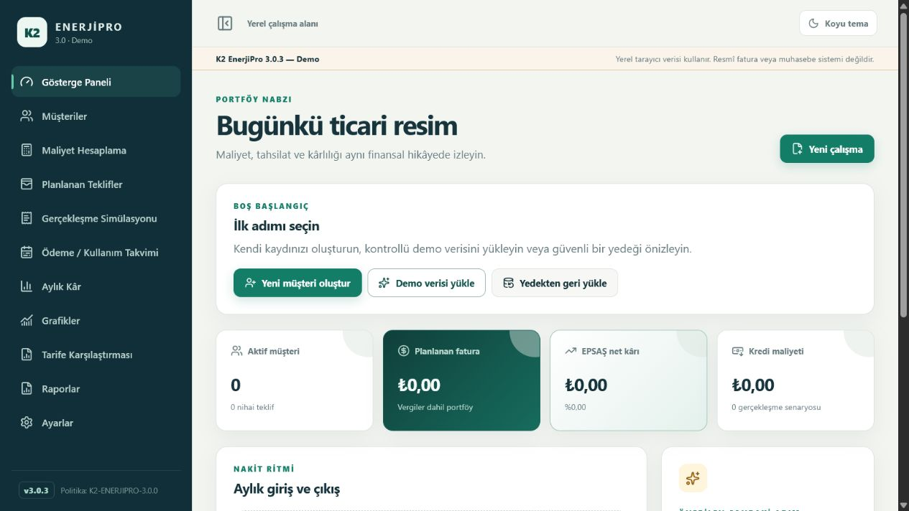

---

## Belge bilgileri

| Bilgi | Değer |
|---|---|
| Uygulama sürümü | 3.0.3 |
| Hesaplama politikası | K2-ENERJIPRO-3.0.0 |
| Backup schema | v2 |
| Veri depolama | Tarayıcı içindeki yerel IndexedDB |
| Hedef kitle | Satış, finans, risk ve teklif ekipleri; demo sunumu yapan kullanıcılar; teknik olmayan yöneticiler |
| Finansman gün bazı | 365 gün |
| Gecikme gün bazı | 360 gün |
| Varsayılan aylık gecikme oranı | %5,55 |
| Belge kapsamı | Demo veri yükleme, müşteri, teklif, ödeme planı, gerçekleşme, takvim, kâr, rapor ve yedekleme |

Bu rehber gerçek uygulama arayüzü, deterministik demo veri seti, hesaplama motoru kodu ve çalışan otomatik testlerle karşılaştırılarak hazırlanmıştır. “Snapshot” sözcüğü bu belgede, **teklif oluşturulduğu andaki fiyat, tarife ve hesaplama değerlerinin değiştirilemez kopyası** anlamına gelir.

## Doğrulanmış uygulama envanteri

1. **Sayfalar ve route’lar:** Gösterge Paneli (`/`), Müşteriler (`/customers`), Müşteri Detayı (`/customers/:customerId`), Maliyet Hesaplama (`/cost-calculation`), Planlanan Teklifler (`/offers`), Teklif Detayı (`/offers/:offerId`), Gerçekleşme Simülasyonu (`/realization` ve `/realization/:scenarioId`), Ödeme / Kullanım Takvimi (`/payment-calendar`), Aylık Kâr (`/monthly-profit`), Grafikler (`/charts`), Tarife Karşılaştırması (`/comparison`), Raporlar (`/reports`), Ayarlar (`/settings`) ve bulunamayan sayfa görünümü.
2. **Temel işlemler:** Müşteri ekleme/arşivleme, taslak ve nihai teklif üretme, ödeme planı kurma, gerçekleşme senaryosu oluşturma, gerçek tahsilat/iade girme, takvim ve kâr inceleme, rapor dışa aktarma, demo veri yönetimi ve backup/restore.
3. **Teklif akışı:** Tüketim → Maliyet → Ödeme planı → Başabaş → Teklif.
4. **Ödeme planları:** Dokuz şablon; ayrıca gelişmiş satır ve mutabakat düzenleyicisi.
5. **Gerçekleşme:** Kaynak tekliften bağımsız senaryo; dönemsel gerçek PTF/YEKDEM, tüketim, tahsilat, iade, komisyon, kredi ve valör değişiklikleri.
6. **Raporlar:** Müşteri Teklif Raporu ve İç Finansal Analiz Raporu çalışır; dört ek rapor seçeneği demoda devre dışıdır.
7. **Ayarlar:** Aylık piyasa verisi, tarife kataloğu, tema, demo veri seti, gecikme politikası, tatil, backup/restore ve 2.17 migration.
8. **Desteklenen GES:** Basit öz tüketim, gelişmiş ölçüm, aylık veya manuel mahsuplaşma, ayrı nakit çıkışı; PTF, PTF+YEKDEM, düzenlemeye tabi veya manuel ihtiyaç fazlası fiyatı.
9. **Desteklenmeyen GES:** Saatlik mahsuplaşma ve faturadan mahsup (`invoice_offset`) final teklifte engellenir.
10. **Tarife:** Her fatura dönemi tarih aralığına göre aktif tarife versiyonu çözümlenir; eksik veya çakışan tarife finali engeller; dönemsel override neden gerektirir.
11. **Backup/restore:** Schema v2 JSON zarfı önizlenir, referansları ve değerleri doğrulanır, onaydan sonra tek bir IndexedDB veritabanı işlemi içinde yazılır.
12. **Demo kayıtları:** Üç müşteri, altı nihai teklif, bir gerçekleşme senaryosu; Temmuz-Ağustos 2026 tahmin ve gerçekleşen piyasa fiyatları.
13. **Uyarılar:** Eksik tarife/fiyat, unsupported GES, eksik override nedeni, legacy snapshot, açık finansman, avans, açık alacak ve geçersiz backup açık mesajlarla gösterilir.
14. **Bilinen sınırlar:** Backend, kullanıcı girişi, çok kullanıcılı çalışma, canlı EPİAŞ, otomatik mevzuat/tarife güncellemesi, e-fatura ve yerleşik PDF motoru yoktur.

---

## 1. K2 EnerjiPro nedir?

K2 EnerjiPro, enerji satış teklifinin yalnızca birim fiyatını değil, teklifin **zaman içindeki nakit ve kârlılık etkisini** birlikte görmeye yarayan yerel bir demo uygulamasıdır. Kullanım dönemi, tüketim, PTF, YEKDEM, tarife, vergiler, tedarikçi ödeme tarihleri, müşteri tahsilatları, finansman ve GES varsayımlarını tek akışta bir araya getirir.

- **Teklif**, müşteriye sunulması planlanan fiyat ve ödeme koşullarını gösterir.
- **Finansman**, tedarikçi çıkışları ile müşteri tahsilatları arasındaki zaman farkının kredi maliyetini veya valör getirisini gösterir.
- **Gerçekleşme**, planlanan teklif değişmeden gerçek fiyat, tüketim ve tahsilatların ayrı bir senaryoda izlenmesidir.
- **Planlanan sonuç**, teklif oluşturulurken bilinen değerlerin değiştirilemez kopyasına dayanır.
- **Gerçekleşen sonuç**, daha sonra girilen gerçek değerler ve gerçek nakit hareketleriyle hesaplanır.

Bu ayrım, “teklif verirken ne bekliyorduk?” ve “sonuçta ne oldu?” sorularının birbirine karışmasını önler.

## 2. Demo sürümünün sınırları

Demo sürümünde:

- Backend ve merkezi veritabanı yoktur.
- Çok kullanıcılı çalışma ve eş zamanlı kayıt yönetimi yoktur.
- Kullanıcı girişi veya rol/yetki sistemi yoktur.
- Veriler yalnız kullanılan tarayıcının IndexedDB alanında saklanır.
- Canlı EPİAŞ entegrasyonu yoktur; PTF ve YEKDEM kullanıcı girdisidir.
- Otomatik mevzuat ve tarife güncellemesi yoktur.
- Resmî e-fatura veya muhasebe entegrasyonu yoktur.
- Saatlik GES mahsuplaşması desteklenmez.
- GES’in faturadan mahsup modu desteklenmez.
- PDF, tarayıcının **Yazdır / PDF olarak kaydet** özelliğiyle üretilir.

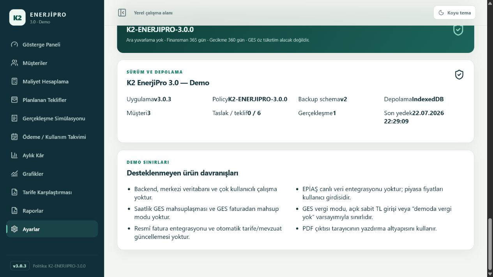

## 3. Uygulamayı başlatma

### 3.1 Geliştirici yöntemi

Windows Terminal veya PowerShell’de proje klasörüne geçin:

```powershell
cd C:\Users\yusuf\Projeler\kepsas\k2-enerji\k2-enerjipro-3.0
npm install
npm run dev -- --host 127.0.0.1
```

Terminalde gösterilen adresi tarayıcıda açın. Standart geliştirme adresi çoğunlukla `http://127.0.0.1:4173` olur.

### 3.2 Hazır build yöntemi

```powershell
cd C:\Users\yusuf\Projeler\kepsas\k2-enerji\k2-enerjipro-3.0
npm install
npm run build
npm run preview
```

Terminalde gösterilen preview adresini açın. Terminal penceresi kapatılırsa yerel sunucu da durur.

## 4. İlk açılış

Boş başlangıç ekranında üç güvenli yol sunulur:

- **Yeni müşteri oluştur:** Müşteri portföyünü açar.
- **Demo verisi yükle:** Ayarlar’daki kontrollü demo alanına götürür.
- **Yedekten geri yükle:** Backup önizleme alanına götürür.

Gösterge Paneli, müşteri/teklif bulunmadığında sıfır özetleri ve “İlk adımı seçin” kartını gösterir. Veriler yüklendikçe aktif müşteri, planlanan fatura, net kâr, kredi maliyeti ve nakit grafiği gerçek hesap sonuçlarından beslenir.

## 5. Demo verisini yükleme

1. Sol menüden **Ayarlar**’ı açın.
2. **Sunum veri seti** bölümüne gidin.
3. **Demo verisi yükle** düğmesine basın.
4. “Demo verisi yüklemek mevcut veriyi değiştirebilir. Önce yedek alın.” uyarısını okuyun.
5. **Uyarıyı kabul et ve yükle** düğmesine basın.
6. “Kontrollü demo verisi yüklendi” bildirimini doğrulayın.

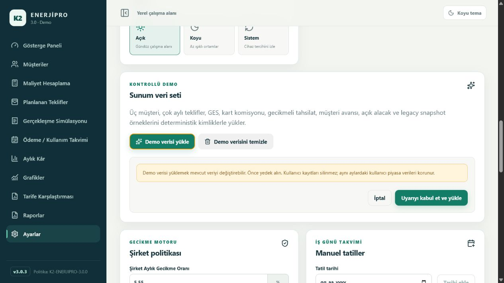

Yüklenen örnekler:

- Demo Anadolu Sanayi
- Demo Merkez Ticarethane
- Demo GES Üretim Tesisi
- Standart vadeli, tam ön ödeme, kısmi avans, komisyonlu kart, Advanced GES ve legacy teklif örnekleri
- Gecikmeli tahsilat ve açık alacak gerçekleşme senaryosu

Demo yükleme, deterministik demo kimliklerini ekler veya günceller. Demo dışındaki kullanıcı kayıtlarını silmez. Aynı aylarda kullanıcı tarafından girilmiş piyasa kayıtlarını korur.

**Demo verisini temizlemek için:** Ayarlar → **Demo verisini temizle** → uyarıyı okuyun → **Yalnız demo verisini temizle**. Bu işlem yalnız deterministik demo kayıtlarını ve “K2 Demo Fixture” kaynaklı aylık fiyatları kaldırır.

## 6. Ekran ve menü yapısı

| Menü / route | Ne işe yarar? | Diğer ekranlara etkisi |
|---|---|---|
| Gösterge Paneli `/` | Portföy özetleri ve nakit görünümü | Kayıtlı müşteri, teklif ve senaryoları özetler |
| Müşteriler `/customers` | Müşteri ekleme, arama ve arşivleme | Tekliflerin müşteriyle bağını sağlar |
| Müşteri Detayı `/customers/:id` | Müşterinin teklif geçmişini gösterir | Yeni maliyet çalışmasına müşteriyle başlatır |
| Maliyet Hesaplama `/cost-calculation` | Beş adımlı teklif hazırlama | Taslak veya sonradan değiştirilemeyen nihai teklif üretir |
| Planlanan Teklifler `/offers` | Nihai teklifleri ve versiyonları listeler | Teklif detayı veya gerçekleşme oluşturur |
| Teklif Detayı `/offers/:id` | Snapshot, fatura, finansman ve kaynak izini gösterir | Takvim ve gerçekleşmeye geçiş sağlar |
| Gerçekleşme Simülasyonu `/realization` | Yeni senaryo başlatır veya senaryo seçer | Kaynak teklifi değiştirmeden actual sonuç üretir |
| Gerçekleşme Detayı `/realization/:id` | Actual fiyat, tüketim, tahsilat ve iade girişi | Takvim, kâr ve iç rapor sonuçlarını etkiler |
| Ödeme / Kullanım Takvimi `/payment-calendar` | Günlük tüketim, nakit ve finansman tablosu | Yeni formül üretmez; kayıtlı hesaplama sonucunu gösterir |
| Aylık Kâr `/monthly-profit` | Tahakkuk ve nakdi ay ay karşılaştırır | Teklif ile senaryoyu yan yana gösterir |
| Grafikler `/charts` | Seçilen teklif ve senaryoların trendleri | Kayıtlı hesap sonuçlarını görselleştirir |
| Tarife Karşılaştırması `/comparison` | Müşteri tasarrufu ve EPSAŞ kârını karşılaştırır | Seçilen teklif snapshot’larını kullanır |
| Raporlar `/reports` | Müşteri ve iç analiz çıktıları | CSV, JSON ve yazdırma sunar |
| Ayarlar `/settings` | Piyasa verisi, tarife, gecikme, demo ve backup | Yeni hesapların varsayım kaynaklarını yönetir |

## 7. Müşteri oluşturma

1. **Müşteriler** menüsünü açın.
2. **Yeni müşteri** düğmesine basın.
3. **Müşteri adı** alanına teklif ve raporlarda görünecek ticari unvanı yazın. Bu alan zorunludur.
4. İsteğe bağlı **Etiket / kategori** alanına “Sanayi”, “Öncelikli” gibi kısa bir sınıf girin.
5. İsteğe bağlı **Müşteri notu** alanına operasyonel not yazın.
6. **Müşteriyi kaydet** düğmesine basın.

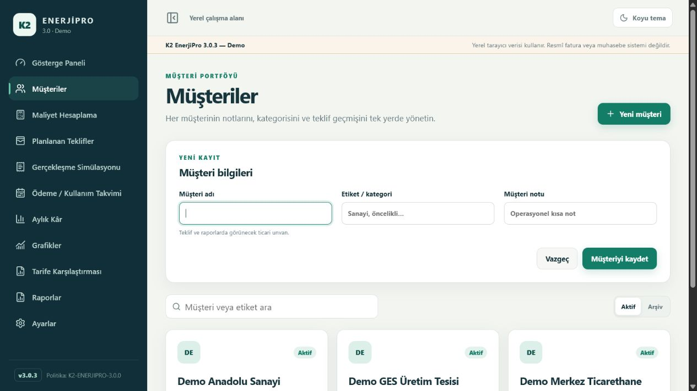

Müşteri kartındaki **Detay** bağlantısı teklif geçmişini açar. **Arşivle**, kaydı silmez; aktif listeden arşiv listesine taşır. Arşivdeki kayıt **Geri yükle** ile yeniden aktif yapılabilir.

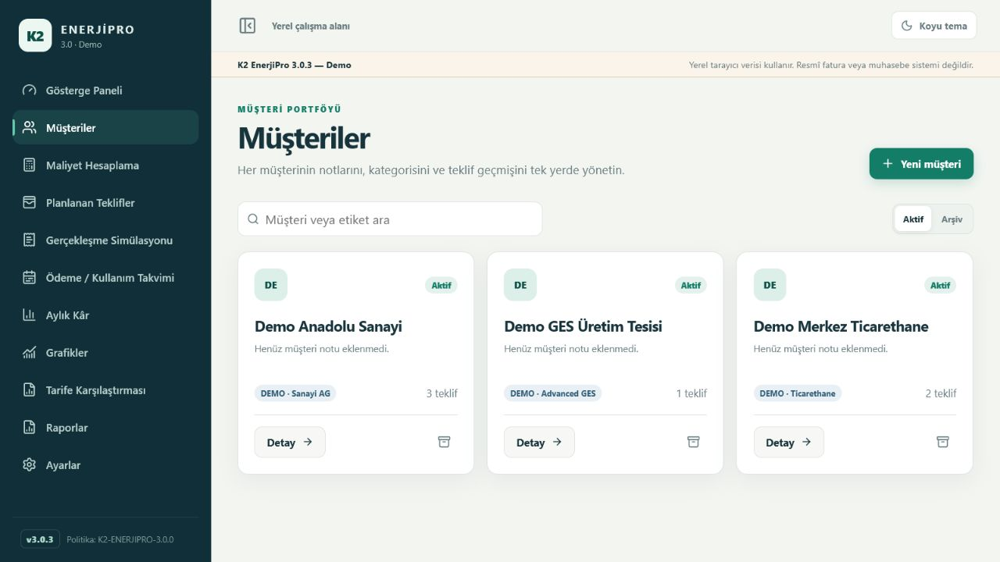

## 8. Yeni teklif hazırlama

Maliyet Hesaplama beş adımdan oluşur. Sol üstteki adım şeridiyle önceki adımlara dönebilirsiniz.

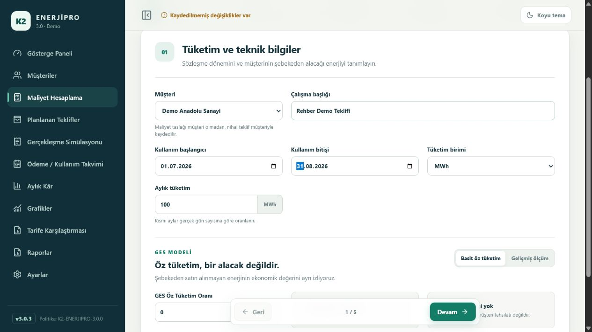

### 8.1 Tüketim ve teknik bilgiler

| Alan | Kullanıcı ne girer? | Birim / etki | Otomatik veya engel |
|---|---|---|---|
| Müşteri | Kayıtlı müşteri | — | Taslak müşterisiz olabilir; final teklif müşterisiz kaydedilemez |
| Çalışma başlığı | Teklifin anlaşılır adı | — | Liste ve raporlarda görünür |
| Kullanım başlangıcı/bitişi | Sözleşme tarihleri | Tarih | Bitiş başlangıçtan önce olamaz |
| Tüketim birimi | MWh veya kWh | Enerji | Hesaplamada MWh’ye dönüştürülür |
| Aylık tüketim | Pozitif tüketim | MWh/kWh | Kısmi aylar gün sayısına göre oranlanır |
| GES modu | Basit veya gelişmiş | — | Desteklenmeyen GES seçimi finali engeller |

### 8.2 Maliyet girdileri

| Alan | Anlamı | Sonuca etkisi |
|---|---|---|
| Müşteri tipi | Tarife profili | Dönemsel KDV, BTV ve dağıtım kaynağını belirler |
| PTF | Piyasa Takas Fiyatı | Aktif enerji tabanının ilk bileşeni; aylık Ayarlar kaydından gelir |
| YEKDEM | Yenilenebilir destek maliyeti | Aktif enerji tabanının ikinci bileşeni; negatif olamaz |
| Dağıtım | Şebeke hizmet bedeli | KDV matrahına girer, BTV matrahına girmez |
| KDV | Katma Değer Vergisi oranı | Dönem tarifesinden gelir |
| BTV | Belediye Tüketim Vergisi oranı | Yalnız aktif enerji satış bedeline uygulanır |
| Sözleşme gücü | Sözleşme geneli sabit bedel | Dönemlere kullanım gününe göre dağıtılır |
| Dengesizlik | Operasyon maliyet oranı | EPSAŞ kârlılığını azaltır |
| PİÜ | Piyasa işlem ücreti oranı | EPSAŞ kârlılığını azaltır |
| Yıllık kredi faizi | Negatif nakit bakiyesi maliyeti | 365 gün, günlük bileşik |
| Yıllık valör faizi | Pozitif bakiye getirisi | 365 gün, günlük bileşik |
| Tedarikçi ödeme farkları | YEKDEM, dağıtım/güç, KDV, BTV günleri | Tedarikçi nakit çıkış tarihini ve finansmanı değiştirir |

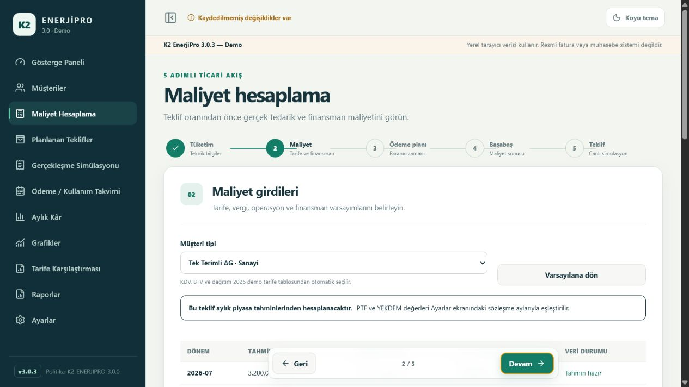

Her dönem için **Dönemsel tarife kaynakları** tablosunda kaynak, versiyon, KDV/BTV/dağıtım ve manuel override durumu görülür.

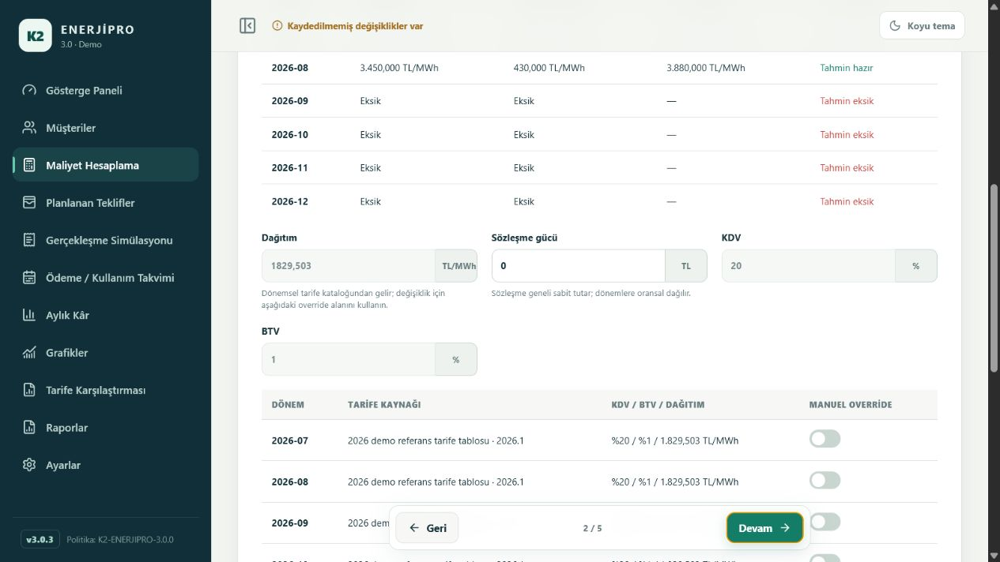

### 8.3 GES alanları

- Basit modda **GES Öz Tüketim Oranı** girilir.
- Gelişmiş modda toplam üretim, eş zamanlı öz tüketim, şebekeden çekiş, şebekeye veriş ve mahsuplaşma sonrası fazla girilir.
- İhtiyaç fazlası için fiyat tipi, ödeme günü ve manuel sabit vergi/maliyet seçilebilir.
- Öz tüketim müşteri tahsilatı veya ayrı nakit girişi değildir; şebekeden satın alınan enerjiyi azaltan ekonomik tasarruftur.

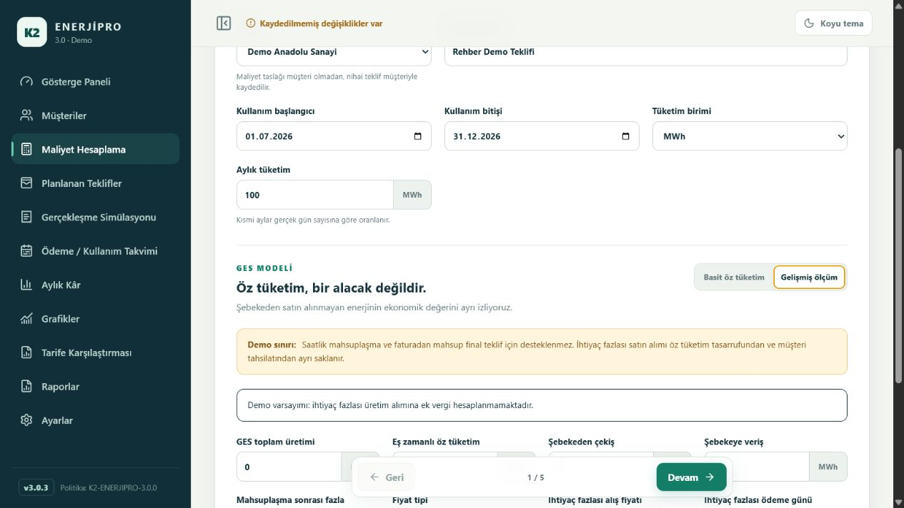

### 8.4 Ödeme planı

Ödeme planı, müşteri faturasının ne zaman ve hangi kanaldan tahsil edileceğini belirler. “Basit” görünüm şablonları, “Gelişmiş” görünüm satır ayrıntılarını ve mutabakatı gösterir.

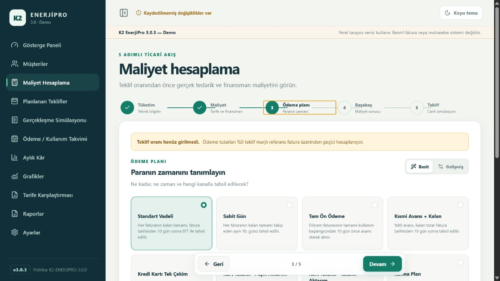

### 8.5 Başabaş ve teklif

Başabaş adımı, kredi/valör ve operasyon maliyetleri dahil EPSAŞ net kârının sıfır olduğu teklif oranını gösterir. Teklif adımında oran elle veya hızlı oran düğmeleriyle seçilir; fatura, finansman, müşteri avantajı ve net kâr canlı güncellenir.

Finali engelleyen başlıca durumlar:

- Müşteri seçilmemiş olması
- Teklif oranının girilmemiş olması
- Geçersiz tarih veya tüketim
- Sözleşme aylarından birinde tahmini PTF/YEKDEM bulunmaması
- Dönemi tamamen kapsayan aktif tarife bulunmaması
- Tarife override nedeni eksik olması
- Saatlik GES veya faturadan mahsup seçilmesi
- Geçersiz ödeme planı satırı

## 9. Teklif hesaplama mantığı

### 9.1 Aktif enerji

```text
Aktif Enerji Tabanı = PTF Tutarı + YEKDEM Tutarı
Teklif Marjı = Aktif Enerji Tabanı × Teklif Oranı
Aktif Enerji Satış Bedeli = Aktif Enerji Tabanı + Teklif Marjı
```

PTF ve YEKDEM birim fiyatları dönem tüketimiyle çarpılarak tutara dönüşür. Teklif oranı yüzde olarak uygulanır.

### 9.2 BTV

```text
BTV Matrahı = Aktif Enerji Satış Bedeli
BTV = BTV Matrahı × BTV Oranı
```

**Dağıtım bedeli BTV matrahına girmez.** Sözleşme gücü ve önceki dönem gecikme satırları da BTV matrahına eklenmez.

### 9.3 KDV

```text
KDV Matrahı =
  Aktif Enerji Satış Bedeli
  + Dağıtım
  + Sözleşme Gücü
  + BTV

KDV = KDV Matrahı × KDV Oranı
```

Hesap motoru ara adımlarda görüntüleme yuvarlaması yapmaz. Ekrandaki iki veya altı basamaklı gösterimler yalnız sunum içindir; hesaplama tam sayısal değerlerle ilerler.

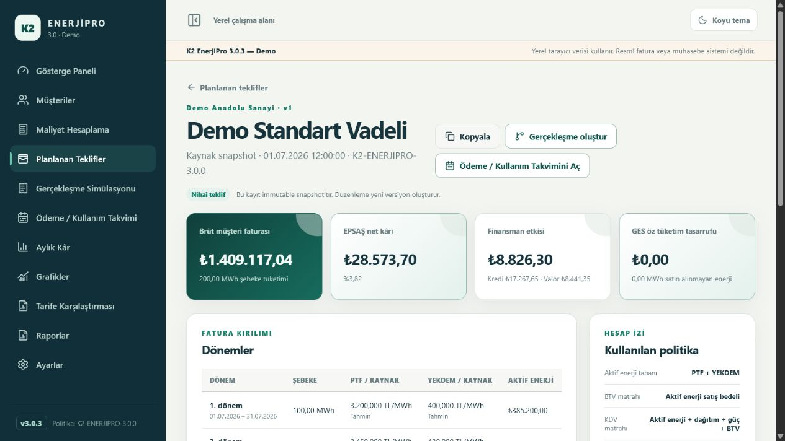

## 10. Tarife kataloğu

Tarife versiyonu, belirli bir müşteri tipi ve tarih aralığı için KDV, BTV ve dağıtım değerlerinin kayıtlı halidir.

- **validFrom:** Tarifenin ilk geçerli günü.
- **validTo:** Tarifenin son geçerli günü. Boşsa açık uçlu olabilir.
- Her fatura dönemi ayrı çözümlenir; Temmuz ve Ağustos farklı tarife snapshot’larına sahip olabilir.
- Varsayılan demo tarifeleri `2026-01-01`–`2026-12-31` aralığındadır.
- 2026 tarifesi 2027’ye sessizce taşınmaz. 2027 dönemi için geçerli tarife yoksa final teklif engellenir.
- Aynı müşteri tipinde çakışan aktif tarifeler kaydedilemez.
- Manuel override açılırsa dönem KDV/BTV/dağıtım değerleri girilir ve **override nedeni** zorunludur.
- Nihai teklif tarife snapshot’ını saklar; Ayarlar’daki tarife daha sonra değişse bile eski teklif değişmez.

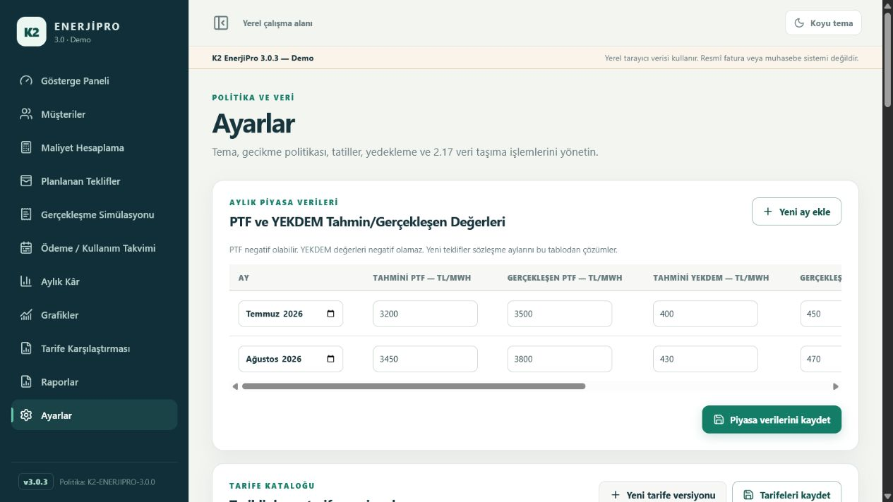

## 11. Aylık PTF ve YEKDEM

**Ayarlar → PTF ve YEKDEM Tahmin/Gerçekleşen Değerleri** tablosunda ay bazında dört değer tutulabilir:

- Tahmini PTF
- Gerçekleşen PTF
- Tahmini YEKDEM
- Gerçekleşen YEKDEM

PTF negatif olabilir; YEKDEM negatif olamaz. Yeni teklif tahmini değerleri, gerçekleşme senaryosu gerçekleşen değerleri kullanır. Çok aylı teklifte her ay kendi kaydından çözülür. Ağustos gerçekleşen fiyatı, Temmuz döneminin hesabında erken kullanılmaz.

Bir sözleşme ayında tahmini PTF veya YEKDEM eksikse nihai teklif engellenir. Eski snapshot’larda aylık kaynak metadata’sı yoksa kayıtlı legacy sayılar korunur ve uyarı gösterilir.

## 12. Ödeme planları

Uygulamadaki gerçek şablonlar:

| Şablon | Ne zaman kullanılır? | Tarih ve tahsilat |
|---|---|---|
| Standart Vadeli | Normal EFT tahsilatı | Her faturanın kalanı fatura tarihinden 10 gün sonra |
| Sabit Gün | Her ay belirli takvim günü | Takip eden ayın 10. günü |
| Tam Ön Ödeme | Kullanım öncesi tam avans | Dönem faturasının %100’ü dönem başlangıcından 10 gün önce |
| Kısmi Avans + Kalan | Avans ve vade birlikte | %80 avans, kalan fatura tarihinden 10 gün sonra |
| Kredi Kartı Tek Çekim | Tek çekim kart | Kalan fatura; banka EPSAŞ’a bir gün sonra aktarır |
| Kart Taksitli · Peşin Aktarım | Müşteri taksitli, EPSAŞ peşin | Müşteri üç taksit; banka EPSAŞ’a tek net aktarım |
| Kart Taksitli · Taksitli Aktarım | Banka da parça parça aktarır | Üç aktarım, 30 gün aralık |
| Karma Plan | Birden fazla kanal/tarih | %30 avans EFT, %40 kart, kalan vadeli EFT |
| Özel Plan | Sözleşmeye özgü koşul | Satırlar kullanıcı tarafından eklenir |

### Gelişmiş satır alanları

Satır adı, aktiflik, dönem kapsamı, tutar tipi, tarih referansı, gün/ay farkı, manuel tarih, ödeme kanalı, taksit sayısı, banka aktarım biçimi, banka valörü, komisyon oranı, komisyonu ödeyen ve not düzenlenebilir.

- **EPSAŞ komisyonu:** Enerji gelirini değiştirmez; EPSAŞ net nakit girişini ve kârı azaltan kanal maliyetidir.
- **Müşteri komisyonu:** Müşterinin brüt tahsilatını artırır; enerji anaparası veya EPSAŞ enerji geliri değildir.
- **Brüt tahsilat:** Müşterinin ödediği toplamdır.
- **Net nakit:** Kanal maliyeti ve aktarım koşulları sonrası EPSAŞ’a ulaşan tutardır.

## 13. Mutabakat

Mutabakat, planlanan ödeme ile fatura alacağı arasındaki fazla veya eksik kısmın nasıl işleneceğini belirler.

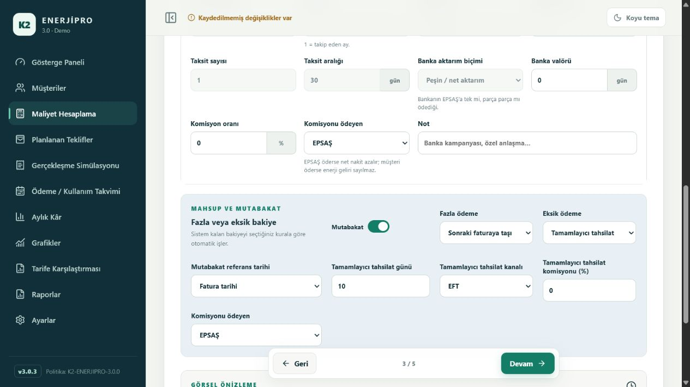

### Mutabakat kapalı

- Fazla ödeme müşteri avansı olarak kalır.
- Eksik ödeme açık alacak olarak kalır.
- Otomatik taşıma, iade veya tamamlayıcı tahsilat üretilmez.

### Fazla ödeme seçenekleri

- **Sonraki faturaya taşı:** Avans sonraki faturanın anaparasına uygulanır; nakit yeniden üretilmez.
- **Belirli gün sonra iade:** Seçilen referans tarihinden belirlenen gün sonra planlı iade talimatı oluşur.
- **Sözleşme sonunda iade:** Kullanılmayan avans sözleşme sonunda iade edilir.

### Eksik ödeme seçenekleri

- **Tamamlayıcı tahsilat:** Belirlenen gün ve kanalda ek tahsilat planlanır.
- **Sonraki faturaya taşı:** Açık alacağın vadesi ve nakit hedefi sonraki faturaya aktarılır.
- **Açık alacak bırak:** Eksik kısım açık alacak olarak izlenir.

### Basit örnekler

1. **100 TL fatura, 150 TL ödeme:** Mutabakat kapalıysa 100 TL alacak kapanır, 50 TL müşteri avansıdır. **Sonraki faturaya taşı** seçiliyse 50 TL sonraki faturaya uygulanır.
2. **100 TL fatura, 50 TL ödeme:** 50 TL anapara kapanır, 50 TL açık alacak kalır. Tamamlayıcı tahsilat seçiliyse bu 50 TL için yeni tahsilat hedefi oluşur.
3. **İki dönemli sonraki faturaya taşıma:** İlk fatura 100 TL, ödeme 150 TL; ikinci fatura 120 TL ise ilk dönemden kalan 50 TL avans ikinci faturaya uygulanır. İkinci dönem gerçek nakit ihtiyacı 70 TL olur. 50 TL yeniden gelir veya kâr yazılmaz.

## 14. Finansman

Finansman ekranı günlük ortak sözleşme bakiyesini kullanır.

```text
Gün başı bakiye
− tedarikçi çıkışları
− müşteri iadeleri
= faiz bazı

Faiz bazı negatifse kredi maliyeti
Faiz bazı pozitifse valör getirisi

Gün sonu = faiz sonrası bakiye + müşteri tahsilatı + gecikme tahsilatı
```

- Kredi ve valör yıllık oranı **365 gün** bazında günlük işler.
- Faiz günlük bileşiktir; her günün kapanışı ertesi günün açılışıdır.
- Hafta sonu ve tatillerde de takvim günü faizi işler.
- Aynı gün tedarikçi çıkışları faiz bazından önce, müşteri tahsilatı faiz hesabından sonra uygulanır.
- Bu nedenle aynı gün gelen müşteri tahsilatı o gün valör üretmez; ertesi günün pozitif açılışına katkı verir.
- Bakiye pozitife çıkınca kredi faizi durur. Sonraki gider bakiyeyi yeniden negatife düşürürse kredi yeniden başlar.
- **Açık finansman bakiyesi**, hesaplama bitişindeki negatif kapanış bakiyesinin mutlak tutarıdır; bu tutar ödenmiş sayılmaz.

## 15. GES

| Özellik | Durum | Açıklama |
|---|---|---|
| Basit öz tüketim | Destekleniyor | Brüt tüketimin belirli yüzdesini öz tüketim kabul eder |
| Advanced metering | Destekleniyor | Üretim, öz tüketim, çekiş, veriş ve fazla ayrı girilir |
| Aylık mahsuplaşma | Destekleniyor | Aylık fiziksel toplamlar kullanılır |
| Manuel mahsuplaşma | Destekleniyor | Mahsuplaşma sonrası fazla kullanıcı girdisidir |
| Saatlik mahsuplaşma | Desteklenmiyor | Saatlik üretim/tüketim serisi gerekir; final engellenir |
| Cash outflow | Destekleniyor | İhtiyaç fazlası alımı ayrı tedarikçi nakit çıkışıdır |
| Invoice offset | Desteklenmiyor | Vergi ve matrah etkileri tanımlı değildir |
| PTF | Destekleniyor | İhtiyaç fazlası PTF ile fiyatlanır |
| PTF+YEKDEM | Destekleniyor | İki fiyatın toplamı kullanılır |
| Manuel fiyat | Destekleniyor | TL/MWh kullanıcı girdisidir |

Kavramlar:

- **Brüt tüketim:** Tesisin toplam enerji ihtiyacı.
- **Öz tüketim:** GES üretiminin tesiste eş zamanlı kullanılan kısmı.
- **Şebekeden çekiş:** Şebekeden satın alınan enerji.
- **Şebekeye veriş:** Şebekeye aktarılan üretim.
- **İhtiyaç fazlası:** Mahsuplaşma sonrası EPSAŞ’ın satın alacağı miktar.
- **Alım fiyatı:** Düzenlemeye tabi, PTF, PTF+YEKDEM veya manuel TL/MWh.
- **Ödeme günü:** Dönem sonundan sonraki gün farkıdır; tatilse ilk iş gününe ötelenir.
- **Manuel sabit maliyet/vergi:** Sözleşme toplamı için açık TL tutarıdır ve dönemlere paylaştırılır.

Öz tüketim ayrı nakit geliri değildir. Şebekeden satın alınmayan enerji miktarını ve buna bağlı ekonomik tasarrufu gösterir. İhtiyaç fazlası alımı ise EPSAŞ açısından ayrı nakit çıkışıdır.

## 16. Teklifi kaydetme ve finalleştirme

- **Taslak:** Düzenlenebilir çalışma kaydıdır. Hesap sonucu saklanabilir ancak müşteriye gönderilecek değiştirilemez nihai teklif değildir.
- **Nihai teklif:** Müşteri, oran, fiyat, tarife, GES, ödeme planı ve hesaplama sonuçlarının değiştirilemez snapshot’ıdır.
- **Değiştirilemez (immutable) nihai teklif:** Nihai kayıt doğrudan düzenlenmez.
- **Yeni versiyon:** Teklif detayındaki **Kopyala** ile yeni çalışma açılır; değişiklik yeni versiyon olarak kaydedilir.

Final düğmesi engelliyse ekrandaki hata/uyarı kartını okuyun. Eksik müşteri, oran, aylık fiyat, tarife veya desteklenmeyen GES seçimi giderilmeden final kaydedilemez.

## 17. Teklif Detayı

Teklif Detayı üst kartlarında şunları gösterir:

- Brüt müşteri faturası ve şebeke tüketimi
- EPSAŞ net kârı ve oranı
- Finansman etkisi: kredi ve valör
- GES öz tüketim tasarrufu

Dönem tablosunda tüketim, PTF/YEKDEM ve kaynakları, aktif enerji, BTV, dağıtım, KDV, brüt toplam ve tarife kaynağı bulunur. **Kullanılan politika** kartı aktif enerji, vergi matrahları, finansman gün bazı ve GES modunu özetler. Alt bölümlerde mutabakat talimatları, piyasa verisi snapshot’ı ve CSV/JSON/Yazdır dışa aktarma seçenekleri yer alır.

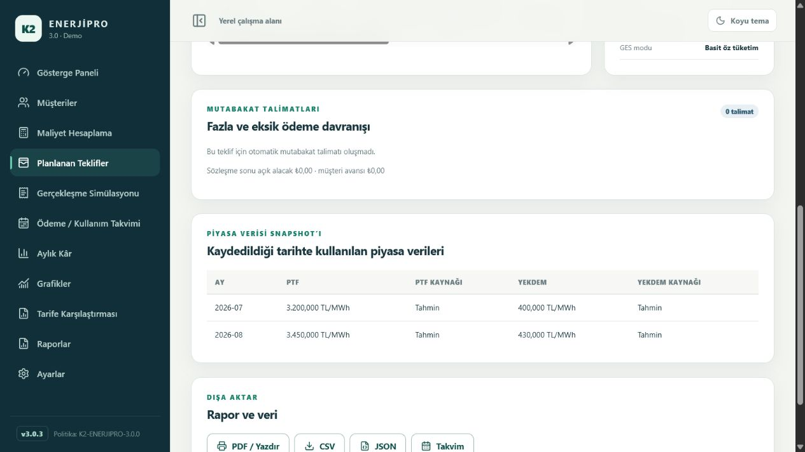

## 18. Gerçekleşme senaryosu

1. **Gerçekleşme Simülasyonu** menüsünü açın.
2. Müşteri ve kaynak nihai teklifi seçin.
3. Senaryo adını yazıp **Senaryo oluştur** düğmesine basın.
4. **Hesaplama tarihi**ni girin; gecikme bu tarihe kadar hesaplanır.
5. Dönemlerde gerçek PTF/YEKDEM veya tüketim override değerlerini girin.
6. Gerekirse senaryo teklif oranı, yıllık kredi ve valör oranlarını değiştirin.
7. Gerçek tahsilatları ilgili fatura, dönem veya vade dilimine bağlayın.
8. Kanal, komisyon ve komisyonu ödeyeni kontrol edin.
9. Gerçek müşteri iadesi varsa avansla sınırlı tutarı ekleyin.
10. **Senaryoyu kaydet** düğmesine basın.

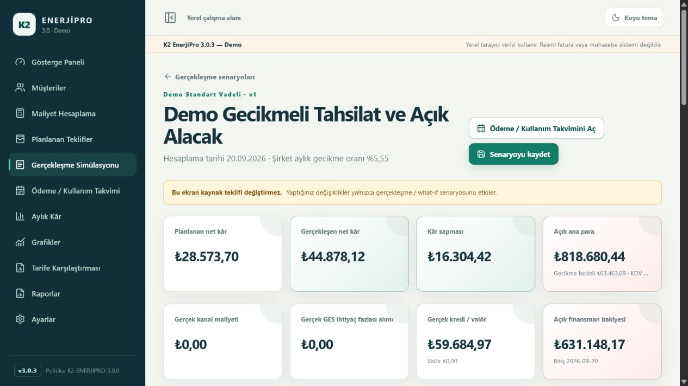

Kaynak teklif değişmez. Ekrandaki sarı bilgi kartı, değişikliklerin yalnız gerçekleşme/what-if senaryosunu etkilediğini açıkça belirtir.

### Gerçek tahsilat

Tahsilat tarihi, tutarı, kanal, komisyon oranı, komisyonu ödeyen ve isteğe bağlı hedef fatura/vade girilir. İleri tarihli tahsilat hesaplama tarihine kadar sonuca alınmaz.

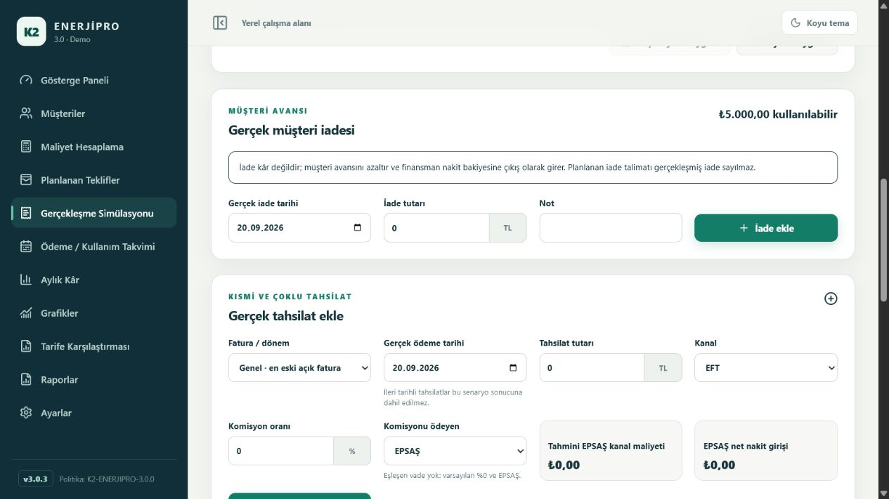

### Gerçek müşteri iadesi

İade yalnız kullanılabilir müşteri avansı kadar eklenebilir. İade kâr değildir; avansı azaltır ve finansman takvimine nakit çıkışı olarak girer.

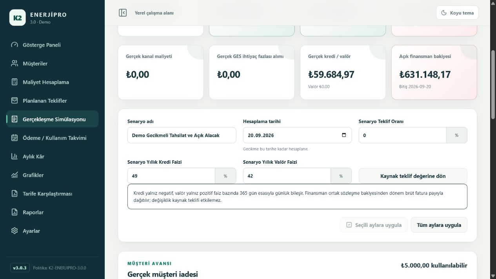

## 19. Gecikme bedeli

Varsayılan politika:

- Aylık oran `%5,55`
- Basit faiz
- 360 gün bazı
- Hafta sonu ve tatiller dahil takvim günü
- Gecikme KDV’sinde ilgili ana faturanın KDV oranı

```text
Gecikme Bedeli = Açık Ana Para × Geciken Gün × (%5,55 / 100) × 12 / 360
```

Kısmi veya çoklu tahsilatta anapara segmentlere ayrılır. Her tahsilata kadar önceki açık ana para, tahsilattan sonra kalan anapara üzerinden faiz hesaplanır. Bu nedenle 100 TL borcun 10. gün 40 TL’si ödenirse ilk segment 100 TL, sonraki segment 60 TL üzerinden ilerler.

Gecikme bedeli ve gecikme KDV’si sonraki faturada ayrı satırlardır. Gecikme bedeli BTV matrahına girmez; daha önce vergilenmiş satıra ikinci kez KDV uygulanmaz. Gecikme satırları kendi üzerinden yeniden gecikme üretmez. Son açık segmentler, hesaplama tarihinde **Nihai Gecikme Bedeli Faturası** olarak gösterilir.

## 20. Ödeme / Kullanım Takvimi

Takvim, planlanan teklif veya gerçekleşme senaryosu seçilerek açılır. Özet kartlarında müşteri nakit girişi, toplam çıkış, kredi, valör, minimum/maksimum bakiye, kapanış, açık alacak, avans, efektif oranlar ve açık finansman bulunur.

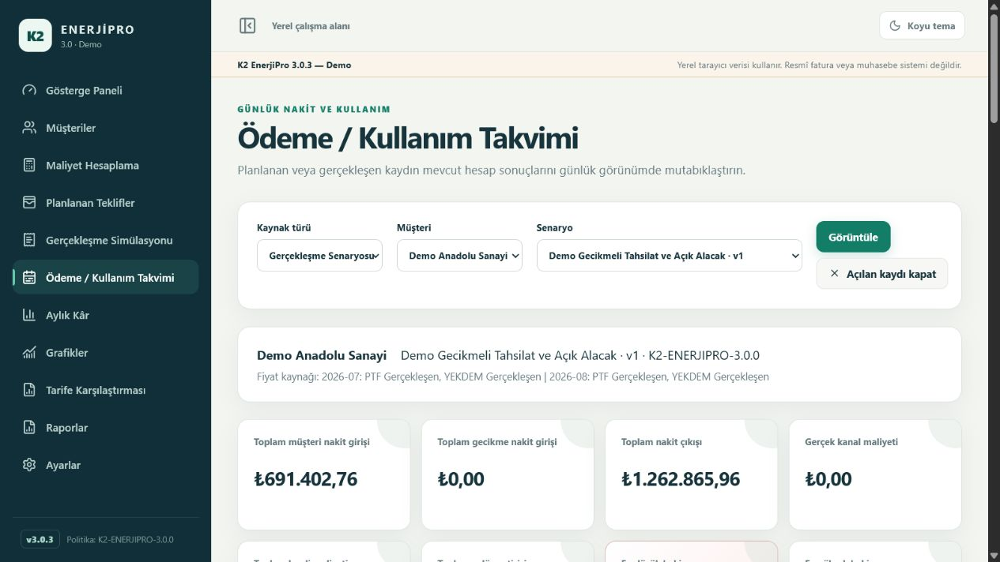

Sütun grupları:

- **Kullanım:** Tarih, gün, günlük tüketim.
- **Tedarikçi çıkışları:** PTF, YEKDEM, dağıtım, sözleşme gücü.
- **Vergiler:** BTV ve KDV çıkışları.
- **GES:** İhtiyaç fazlası alımı/mahsubu.
- **Müşteri:** Brüt anapara, net nakit, gecikme tahsilatı, iade, ödeme kanalı maliyeti.
- **Ledger:** Avans ve açık alacak bakiyeleri, ödeme planı satırı.
- **Finansman:** Açılış, çıkışlar sonrası bakiye, faiz bazı, valör, kredi, kapanış.
- **Not:** Tedarikçi ödemesi, tahsilat, gecikme belgesi veya mutabakat açıklaması.

Takvim yeni bir ticari formül hesaplamaz; teklif veya gerçekleşme motorunun ürettiği olayları günlük sıraya koyar ve kullanıcıya gösterir.

## 21. Aylık Kâr

- **Tahakkuk:** Enerjinin ekonomik olarak ait olduğu ayın gelir ve maliyetleri.
- **Nakit:** Paranın gerçekten hareket ettiği ayın giriş ve çıkışları.
- **Planlanan kâr:** Teklif snapshot’ından üretilir.
- **Gerçekleşen kâr:** Seçilen gerçekleşme senaryosundan üretilir.
- **Mutabık:** Profit ledger bileşenleri ile aylık toplam farkı `1e-6` toleransı içindedir.
- **Mutabakat farkı:** Beklenen toplam ile aylık kırılım arasındaki farktır.
- **Mutabakat hesaplanmadı:** Eski snapshot gerekli reconciliation alanlarını taşımıyordur; otomatik olarak “mutabık” kabul edilmez.
- **Legacy snapshot:** Eski kaydın mevcut sayısal sonuçları korunur, eksik kaynak metadata’sı uyarıyla belirtilir.

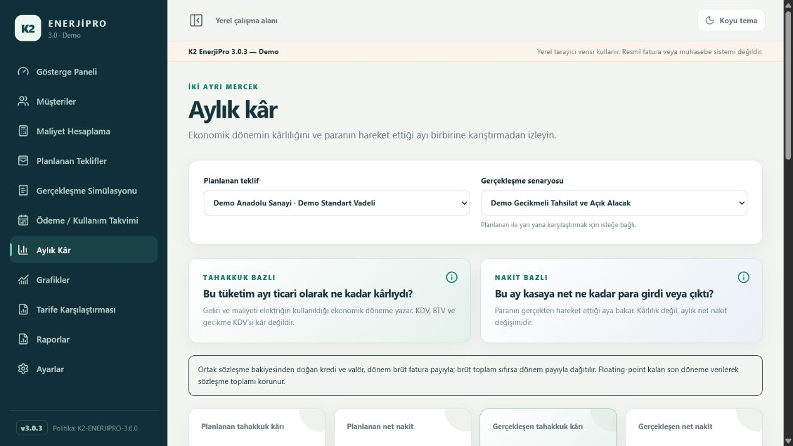

Tahakkuk kârı ile nakit sonucu aynı olmak zorunda değildir. Örneğin satış Temmuz’a aitken müşteri Eylül’de ödeme yapabilir; tahakkuk Temmuz’da, nakit Eylül’de görünür.

## 22. Raporlar

### 22.1 Müşteri Teklif Raporu

Müşteri, teklif, kullanım dönemi, tarife/piyasa kaynağı, dönem faturaları, toplam tüketim, GES tasarrufu ve ödeme planını içerir. Net kâr, kredi maliyeti, profit ledger veya iç override nedeni gibi şirket içi finansal bilgiler bu raporda bulunmaz.

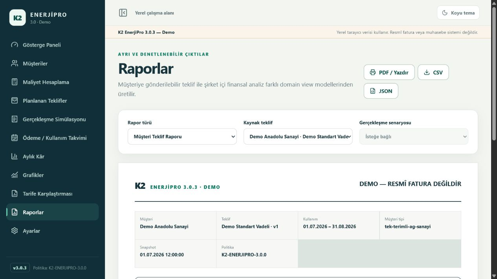

### 22.2 İç Finansal Analiz

İç raporda şunlar bulunur:

- Net kâr ve birim kâr
- Kredi maliyeti ve valör geliri
- Dengesizlik ve PİÜ
- Ödeme kanalı maliyeti ve GES ihtiyaç fazlası alımı
- Açık finansman, açık alacak ve müşteri avansı
- Piyasa fiyatı ve tarife snapshot’ı
- Manuel override nedeni
- Mutabakat talimatları
- Profit ledger
- Aylık tahakkuk ve nakit
- Gecikme belgeleri ve uyarılar

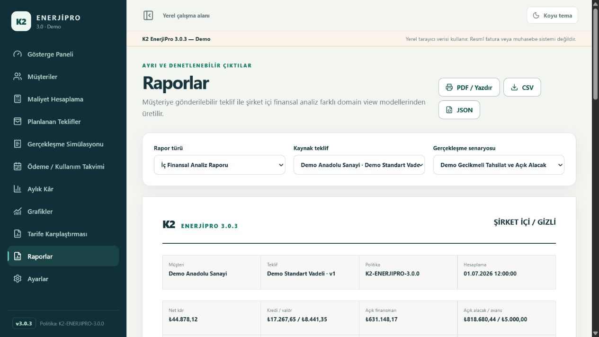

### 22.3 Dışa aktarma

- **CSV:** Tablo programlarında açılabilen satır çıktısı.
- **JSON:** Rapor modelinin yapılandırılmış çıktısı.
- **PDF / Yazdır:** Tarayıcının yazdırma penceresini açar; hedef olarak PDF kaydetme seçilebilir.

## 23. Backup ve restore

### Tam yedek alma

1. Ayarlar → **3.0 veri taşınabilirliği** bölümüne gidin.
2. **Tam yedek indir** düğmesine basın.
3. Dosyayı güvenli klasörde saklayın.

Dosya adı `k2-energipro-3.0-yedek-YYYY-MM-DD.json` biçimindedir. JSON zarfında `format: K2-ENERJIPRO`, `schemaVersion: 2` ve `appVersion: 3.0.3` bulunur.

### Geri yükleme

1. **Yedek geri yükle** düğmesiyle JSON dosyasını seçin.
2. Önizlemede müşteri, taslak, teklif, gerçekleşme, aylık fiyat, legacy ve migration sayılarını kontrol edin.
3. Uyarıları okuyun.
4. **Önizlemeyi onayla ve geri yükle** düğmesine basın.

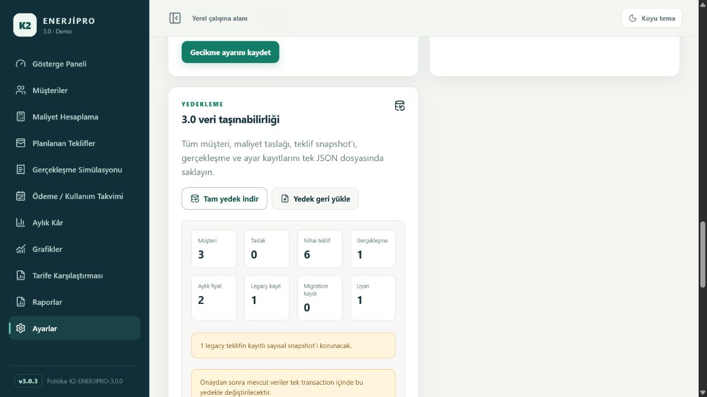

Restore önce dosya biçimini, schema sürümünü, tekrar eden kimlikleri, tarihleri, negatif veya sonlu olmayan değerleri ve müşteri/teklif bağlantılarını doğrular. Eski 3.0 yedek zarfı güncel biçime dönüştürülür; eski teklifin sayısal snapshot’ı korunur. Onaydan sonra tüm veri grupları tek bir veritabanı işlemi içinde yazılır. Geçersiz dosya önizleme aşamasında reddedildiği için mevcut veriler temizlenmez.

> Büyük ayar, tarife veya portföy değişikliğinden önce mutlaka tam yedek alın.

## 24. Sık karşılaşılan uyarılar

| Uyarı | Anlamı | Çözüm |
|---|---|---|
| “... dönemi için geçerli tarife bulunamadı. Nihai teklif oluşturulamaz.” | Dönemi kapsayan tek aktif tarife yok | Ayarlar’da doğru müşteri tipi ve tarih aralığıyla tarife ekleyin |
| “Tahmini PTF / YEKDEM eksik” | Sözleşme ayının tahmini fiyatı yok | Ayarlar’da ilgili aya tahmini fiyat girin |
| “Saatlik mahsuplaşma ... desteklenmiyor” | Demo saatlik seri hesaplamıyor | Aylık veya manuel mahsuplaşma seçin |
| “Faturadan mahsup ... desteklenmiyor” | Vergi ve matrah davranışı tanımlı değil | Ayrı nakit çıkışı seçin |
| “Override nedeni zorunludur” | Tarife değeri elle değiştirildi | Dönemsel override nedenini yazın |
| “Mutabakat hesaplanmadı” | Eski snapshot reconciliation kanıtı taşımıyor | Kaydı legacy olarak değerlendirin; yeni versiyon üretin |
| “Legacy snapshot — tarife kaynak metadata’sı bulunmuyor” | Eski teklif yalnız sayısal değer taşıyor | Sayıları koruyun; kaynak denetimi için yeni teklif oluşturun |
| “Açık finansman bakiyesi” | Hesaplama bitişinde nakit bakiyesi negatif | Tahsilat tarihlerini, kredi oranını ve bitiş tarihini inceleyin |
| “Müşteri avansı” | Tahsilat alacağı aşmış | Mutabakat/iade kuralını ve sonraki fatura uygulamasını kontrol edin |
| “Açık alacak” | Ana paranın tamamı tahsil edilmemiş | Gerçek tahsilat veya mutabakat kuralı girin |
| “Yedek dosyası okunamadı” | JSON, schema veya referanslar geçersiz | Doğru K2 backup dosyasını seçin; mevcut veriyi silmeyin |
| “Nihai teklif için müşteri zorunludur” | Taslak müşterisizdir | Bir müşteri seçin |
| “Nihai teklif için teklif oranı zorunludur” | Teklif oranı boş | Teklif adımında oran girin |

## 25. Sık sorulan sorular

1. **PTF negatif olabilir mi?** Evet. Ayarlar ekranı negatif PTF’ye izin verir.
2. **YEKDEM negatif olabilir mi?** Hayır; sıfır veya pozitif olmalıdır.
3. **Eski teklif ayarlar değişince değişir mi?** Hayır. Nihai teklif fiyat ve tarife snapshot’ını saklar.
4. **Kredi faizi neden devam ediyor?** Günlük faiz bazı negatif kaldığı sürece 365 gün esasıyla bileşik işler.
5. **Bakiye pozitife çıkınca kredi durur mu?** Evet. Sonraki gider bakiyeyi negatife düşürürse yeniden başlar.
6. **Aynı gün tahsilat neden valör üretmiyor?** Günlük sıra tedarikçi çıkışları ve faizden sonra müşteri tahsilatını kapanışa ekler.
7. **Komisyon açık alacağı etkiler mi?** Enerji anaparası tahsilatını değiştirmez; EPSAŞ veya müşteri kanal maliyeti olarak ayrı izlenir.
8. **Müşteri avansı kâr mıdır?** Hayır. Kullanılana veya iade edilene kadar yükümlülüktür.
9. **GES öz tüketimi nakit girişi midir?** Hayır. Şebekeden satın alınmayan enerji tasarrufudur.
10. **İhtiyaç fazlası GES nasıl görünür?** EPSAŞ’ın tedarikçi nakit çıkışı ve kâr maliyeti olarak görünür.
11. **Gerçekleşen net kâr ile nakit neden farklıdır?** Kâr ekonomik aya, nakit ödeme/tahsilat ayına aittir.
12. **Eski kayıt neden “Mutabakat hesaplanmadı” gösteriyor?** Eski snapshot yeni reconciliation alanlarını taşımıyor olabilir.
13. **2027 teklifi neden engelleniyor?** Varsayılan tarife 2026 sonunda biter; 2027 için geçerli tarife gerekir.
14. **Demo verisini temizlemek gerçek müşteriyi siler mi?** Hayır; yalnız deterministik demo kimliklerini temizler.
15. **Dağıtım BTV’ye girer mi?** Hayır. BTV yalnız aktif enerji satış bedeli üzerinden hesaplanır.
16. **Dağıtım KDV’ye girer mi?** Evet; KDV matrahının bileşenidir.
17. **Kısmi tahsilatta gecikme nasıl hesaplanır?** Her ödeme tarihine kadar açık kalan anapara ayrı segmenttir.
18. **Gecikme bedeli yeniden gecikme üretir mi?** Hayır; gecikme satırları yeni gecikme anaparası değildir.
19. **Planlanan iade gerçek iade sayılır mı?** Hayır. Gerçek iade ayrıca gerçekleşme ekranında girilir.
20. **CSV ile PDF aynı bilgiyi mi içerir?** Aynı rapor kaynağından üretilir; düzen ve bazı sunum alanları formata göre değişebilir.
21. **Tarife override neden zorunludur?** Standart katalogdan sapmanın denetlenebilir gerekçesini saklamak için.
22. **Yedek geri yükleme başarısız olursa veriler silinir mi?** Dosya önizleme/doğrulama aşamasında reddedilirse mevcut veriler korunur.

## 26. Terimler sözlüğü

| Terim | Açıklama |
|---|---|
| EPSAŞ | Bu rehberde enerji satış ve finansman sonucunu izlenen şirket tarafı |
| PTF | Piyasa Takas Fiyatı; enerji piyasasındaki temel fiyat girdisi |
| YEKDEM | Yenilenebilir Enerji Kaynaklarını Destekleme Mekanizması maliyet bileşeni |
| BTV | Belediye Tüketim Vergisi; aktif enerji satış bedeli üzerinden hesaplanır |
| KDV | Katma Değer Vergisi; aktif enerji, dağıtım, güç ve BTV toplamına uygulanır |
| Dağıtım bedeli | Şebeke kullanım/hizmet bedeli |
| Sözleşme gücü | Sözleşmeye bağlı sabit güç bedeli |
| Dengesizlik | Tahmin-gerçekleşme farkları için maliyet varsayımı |
| PİÜ | Piyasa işlem ücreti |
| Valör | Pozitif nakit bakiyesinin günlük getirisi |
| Kredi maliyeti | Negatif nakit bakiyesinin günlük finansman maliyeti |
| Brüt tahsilat | Müşterinin ödediği toplam tutar |
| Net nakit | Kanal maliyeti ve aktarım sonrası EPSAŞ’a ulaşan tutar |
| Açık alacak | Tahsil edilmemiş ana para |
| Müşteri avansı | Mevcut alacağı aşan müşteri ödemesi |
| Mutabakat | Fazla/eksik ödemenin taşıma, iade veya tahsilat kuralı |
| Tahakkuk | Gelir/maliyetin ekonomik olarak ait olduğu dönem |
| Nakit akışı | Paranın fiilen giriş ve çıkış tarihleri |
| Snapshot | Teklif anındaki fiyat, tarife ve hesapların değiştirilemez kopyası |
| İhtiyaç fazlası üretim | Mahsuplaşma sonrası şebekeye verilen ve satın alınan GES enerjisi |
| Öz tüketim | GES üretiminin tesiste kullanılan kısmı |
| Gecikme bedeli | Vadesi geçen açık anaparaya uygulanan basit faiz tutarı |

## 27. Kontrol listeleri

### Teklif finalleştirmeden önce

- [ ] Doğru müşteri seçildi.
- [ ] Kullanım tarihleri ve tüketim birimi kontrol edildi.
- [ ] Tüm ayların tahmini PTF/YEKDEM kaydı var.
- [ ] Her dönemi kapsayan tek aktif tarife var.
- [ ] Override varsa nedeni yazıldı.
- [ ] GES modu destekleniyor.
- [ ] Ödeme planı, kanal ve komisyon doğru.
- [ ] Mutabakat kuralı sözleşmeyle uyumlu.
- [ ] Kredi, valör ve tedarikçi ödeme günleri kontrol edildi.
- [ ] Teklif oranı ve başabaş sonucu incelendi.

### Gerçekleşme kaydetmeden önce

- [ ] Doğru kaynak teklif ve versiyon seçildi.
- [ ] Hesaplama tarihi doğru.
- [ ] Gerçek fiyat/tüketim override’ları ilgili dönemlere girildi.
- [ ] Tahsilatlar doğru fatura veya vade dilimine bağlandı.
- [ ] Komisyon ve net nakit kontrol edildi.
- [ ] İade kullanılabilir avansı aşmıyor.
- [ ] Açık alacak, gecikme ve açık finansman incelendi.

### Rapor göndermeden önce

- [ ] Müşteri raporu ile iç rapor karıştırılmadı.
- [ ] Doğru teklif/senaryo seçildi.
- [ ] Sürüm `3.0.3` görünüyor.
- [ ] Müşteri raporunda iç finansal alan yok.
- [ ] Tarife ve piyasa kaynakları kontrol edildi.
- [ ] PDF önizlemesinde tablo kesilmesi yok.

### Yedek geri yüklemeden önce

- [ ] Mevcut sistemden güncel tam yedek alındı.
- [ ] Dosya K2 EnerjiPro backup dosyası.
- [ ] Önizleme kayıt sayıları beklenen değerlerle uyumlu.
- [ ] Legacy/migration uyarıları okundu.
- [ ] Yanlış tarayıcı profili kullanılmıyor.
- [ ] Onaydan sonra mevcut koleksiyonların değişeceği biliniyor.

## 28. Ekler

### Ek A — Destek matrisi

| Alan | Demo desteği |
|---|---|
| Müşteri ve teklif | Var |
| Çok aylı PTF/YEKDEM | Var |
| Tarihli tarife snapshot’ı | Var |
| Gelişmiş ödeme planı ve mutabakat | Var |
| Günlük kredi/valör | Var |
| Basit ve advanced GES | Var; saatlik ve invoice-offset hariç |
| Gerçekleşme ve gecikme | Var |
| Takvim, aylık kâr, grafik, karşılaştırma | Var |
| Müşteri/iç rapor | Var |
| Backup/restore ve legacy migration | Var |
| Backend, giriş, merkezi veri | Yok |
| Canlı EPİAŞ/e-fatura | Yok |

### Ek B — Formül özeti

```text
Aktif taban = PTF + YEKDEM
Aktif satış = aktif taban + teklif marjı
BTV = aktif satış × BTV oranı
KDV = (aktif satış + dağıtım + güç + BTV) × KDV oranı
Gecikme = açık anapara × gün × aylık oran × 12 / 360
Kredi = negatif günlük faiz bazı × yıllık kredi oranı / 365
Valör = pozitif günlük faiz bazı × yıllık valör oranı / 365
```

### Ek C — Demo veri seti özeti

| Tür | Kayıtlar |
|---|---|
| Müşteri | Demo Anadolu Sanayi; Demo Merkez Ticarethane; Demo GES Üretim Tesisi |
| Teklif | Standart Vadeli; Tam Ön Ödeme; Kısmi Avans + Kalan; Komisyonlu Kart; Advanced GES; Legacy Snapshot |
| Gerçekleşme | Demo Gecikmeli Tahsilat ve Açık Alacak |
| Piyasa ayı | 2026-07 ve 2026-08 tahmin/gerçekleşen PTF-YEKDEM |

### Ek D — Sürüm bilgileri

- Uygulama: 3.0.3
- Hesaplama politikası: K2-ENERJIPRO-3.0.0
- Backup schema: 2
- IndexedDB adı: `k2-energipro-3`
- Belge: 22 Temmuz 2026

### Ek E — Bilinen sınırlamalar

Bu belgenin 2. bölümündeki ürün sınırlarına ek olarak, uygulama build çıktısı tek büyük JavaScript paketi üretir; ilk açılış performansı düşük cihazlarda etkilenebilir. Bu durum hesap doğruluğunu değiştirmez.

### Ek F — İçerik doğruluk matrisi

| Rehber bölümü | İlgili route | Browser ile doğrulandı | Ekran görüntüsü | Not |
|---|---|---:|---|---|
| Kapak / ilk açılış | `/` | Evet | 01 | Boş IndexedDB origin’i |
| Demo sınırları | `/settings` | Evet | 22 | Gerçek UI listesi |
| Başlatma | `/` | Evet | 01 | Dev sunucu `localhost:4173` |
| Demo yükleme | `/settings#demo-data` | Evet | 02 | Uyarı ve başarı bildirimi |
| Menü yapısı | Tüm route’lar | Evet | 01–22 | 15 route kaynakla karşılaştırıldı |
| Müşteri | `/customers` | Evet | 03–04 | Form alanları ve demo kartları |
| Teklif genel | `/cost-calculation` | Evet | 05 | Adım 1 |
| Piyasa fiyatı | `/cost-calculation`, `/settings` | Evet | 06 | Tahmin hazır/eksik durumu |
| Tarife | `/cost-calculation`, `/settings` | Evet | 07, 20 | Dönem ve katalog |
| Ödeme planı | `/cost-calculation` | Evet | 08 | Dokuz şablon |
| Mutabakat | `/cost-calculation` | Evet | 09 | Gelişmiş görünüm |
| GES | `/cost-calculation` | Evet | 10 | Advanced alanlar ve sınır uyarısı |
| Hesaplama sonucu | `/offers/demo-offer-standard` | Evet | 11 | Demo snapshot toplamları |
| Teklif detayı | `/offers/demo-offer-standard` | Evet | 12 | Politika ve kaynak izi |
| Gerçekleşme | `/realization/demo-scenario-realization` | Evet | 13 | Plan/actual özet |
| Gerçek tahsilat | Aynı route | Evet | 14 | Kısmi/çoklu tahsilat formu |
| Gerçek iade | Aynı route | Evet | 15 | Kullanılabilir avans |
| Gecikme | Aynı route | Evet | 13–15 | Dönem ve nihai belgeler DOM’da doğrulandı |
| Takvim | `/payment-calendar?...` | Evet | 16 | Gerçekleşme kaynağı ve hareket günleri |
| Aylık kâr | `/monthly-profit` | Evet | 17 | Planlanan + gerçekleşen seçim |
| Müşteri raporu | `/reports` | Evet | 18 | İç kâr alanı yok |
| İç rapor | `/reports` | Evet | 19 | Net kâr ve profit ledger var |
| Backup/restore | `/settings#backup` | Evet | 21 | Uygulama export’u yeniden seçildi |
| Sık uyarılar / SSS / sözlük | İlgili route’lar | Evet | 02, 07, 10, 13, 21, 22 | UI metinleri kaynakla karşılaştırıldı |
| Kontrol listeleri / ekler | Tüm akış | Evet | 01–22 | E2E 6/6 ile çapraz kontrol |

---

**Belge sonu — K2 EnerjiPro 3.0.3 Demo Kullanıcı Rehberi**
